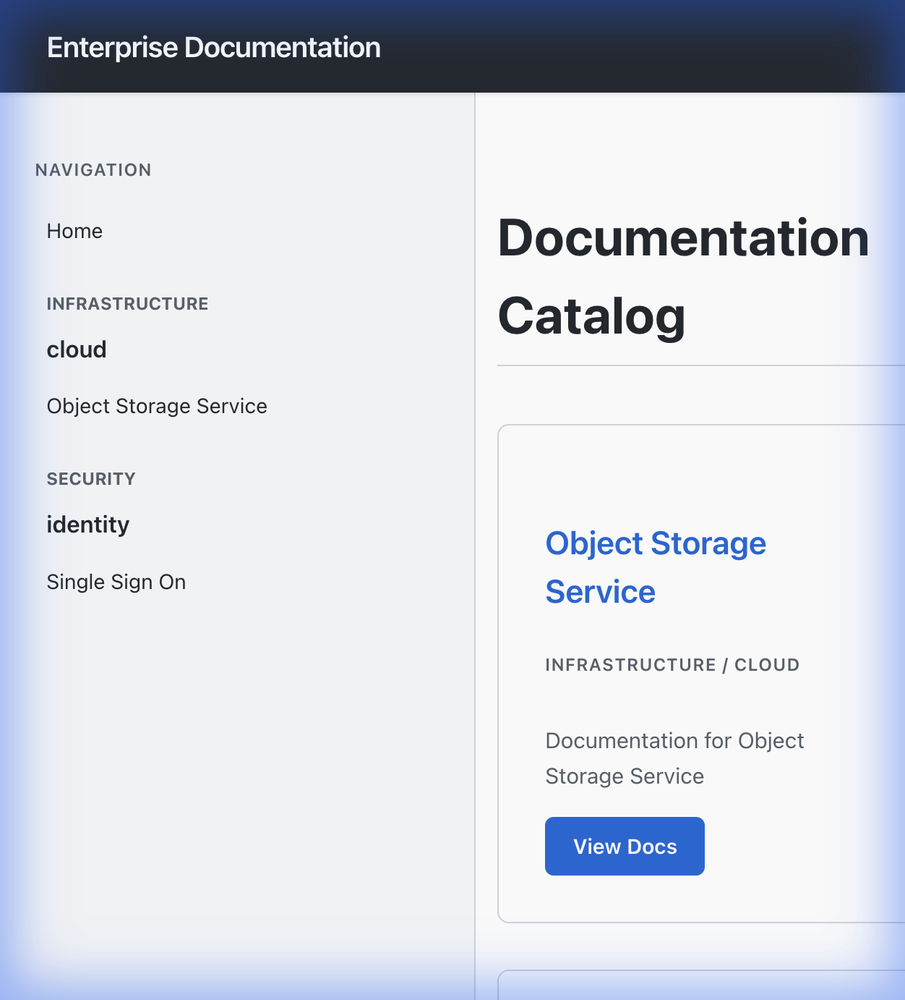
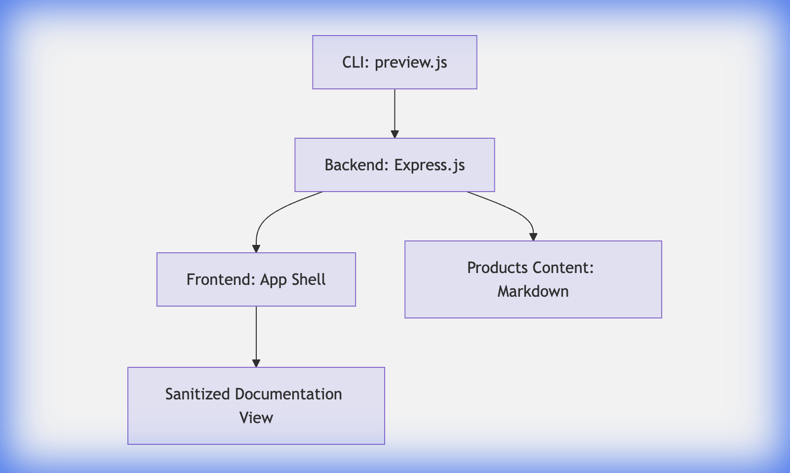

# MarkedJS - Enterprise Documentation Portal

A lightweight, secure, and modular documentation portal built with **Node.js**, **Express**, and **marked.js**. It scans a directory of markdown files and serves them as a structured, searchable, and elegant documentation site.



## 🚀 Features

- **Dynamic Catalog**: Automatically builds a `Domain > System > Product` hierarchy from the file system.
- **Contextual Navigation**: 
    - Full catalog view on the Landing Page.
    - Focused, product-specific navigation on Documentation pages.
- **Secure Rendering**: Server-side markdown rendering with `marked` and sanitization with `DOMPurify`.
- **Elegant UI**: Modern, responsive design with a clean typography stack (Inter/System).
- **Mobile Friendly**: Responsive sidebar and layout for small screens.
- **CLI Preview**: Built-in CLI tool to preview documentation locally.
- **Mermaid Support**: Native rendering of Mermaid diagrams.

## 🏗️ Architecture

The project follows a clean separation of concerns:



### Components

1.  **Backend (`/backend`)**:
    - Express.js server.
    - Handles file system scanning (`catalog.js`).
    - Converts Markdown to HTML (`renderer.js`).
    - Exposes API endpoints:
        - `GET /api/navigation`: Returns the catalog structure.
        - `GET /api/page/*`: Returns sanitized HTML for a page.

2.  **Frontend (`/frontend`)**:
    - Static "App Shell" (`index.html`, `app.js`, `style.css`).
    - Client-side routing (SPA feel).
    - Fetches data from the backend and updates the DOM.
    - Context-aware sidebar logic.

3.  **CLI (`/cli`)**:
    - Node.js executable wrapper.
    - Orchestrates the backend startup.
    - Allows specifying a custom content directory.

---

## 🛠️ Installation & Setup

### Prerequisites
- Node.js (v18+ recommended)
- npm

### Quick Start

1.  **Clone the repository**:
    ```bash
    git clone https://github.com/your-org/markedjs.git
    cd markedjs
    ```

2.  **Install dependencies**:
    ```bash
    # Install backend dependencies
    cd backend && npm install
    
    # Install CLI dependencies (link backend)
    cd ../cli && npm install
    ```

3.  **Run the Preview**:
    From the root directory:
    ```bash
    node cli/bin/preview.js
    ```
    The portal will be available at `http://localhost:3000`.

### Scoped Preview

To preview a specific product or directory:

```bash
node cli/bin/preview.js products/infrastructure/cloud/s3
```
This serves the documentation scoped to that folder.

---

## 📂 Content Structure

Documentation is organized by `Domain > System > Product`.

```text
products/
├── infrastructure/       # Domain
│   └── cloud/            # System
│       └── s3/           # Product
│           ├── docs.yaml # Configuration
│           ├── intro.md
│           └── api.md
```

### `docs.yaml` Configuration

Each product directory must have a `docs.yaml` defining its metadata and navigation:

```yaml
title: "Object Storage Service"
description: "Scalable and secure object storage."
navigation:
  - Label: "Introduction"
    url: "/intro"
  - Label: "API Reference"
    url: "/api"
```

---

## 💻 Development

To work on the project itself:

1.  **Backend Logic**: Edit files in `backend/src/`. Restart the server to apply changes.
2.  **Frontend UI**: Edit `frontend/style.css` or `app.js`. Refresh the browser to see changes (the backend serves these static files).

### Key Files by Function

- **Navigation Logic**: `frontend/app.js` -> `renderSidebar()`
- **Styling**: `frontend/style.css` (Variables, Layout, Typography)
- **Markdown Parsing**: `backend/src/renderer.js`
- **Catalog Scanning**: `backend/src/catalog.js`

---

## 📄 License

MIT
