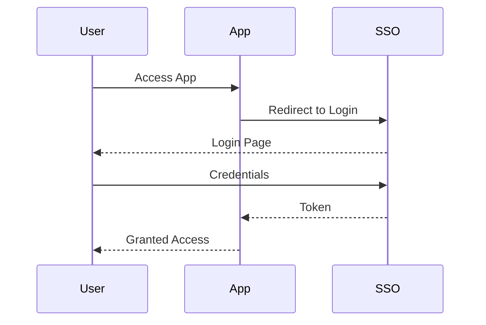

# Single Sign On (SSO)

Centralized authentication service.

## Integration

Use OIDC or SAML.

```mermaid
sequenceDiagram
    User->>App: Access App
    App->>SSO: Redirect to Login
    SSO-->>User: Login Page
    User->>SSO: Credentials
    SSO-->>App: Token
    App-->>User: Granted Access
```
